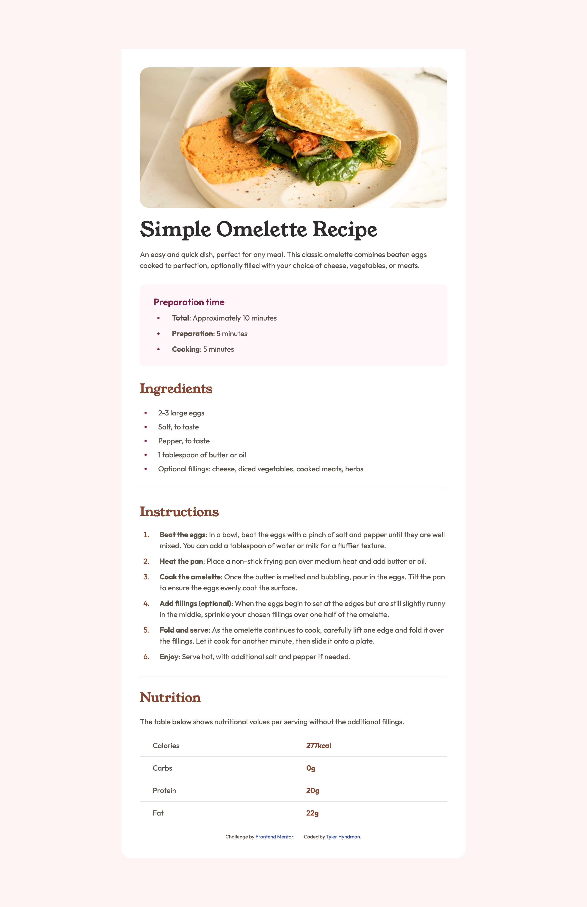

# Frontend Mentor - Recipe page solution

This is a solution to the [Recipe page challenge on Frontend Mentor](https://www.frontendmentor.io/challenges/recipe-page-KiTsR8QQKm). Frontend Mentor challenges help you improve your coding skills by building realistic projects. 

## Table of contents

- [Overview](#overview)
  - [Project Solution Screenshot](#project-solution-screenshot)
  - [Links](#links)
- [My process](#my-process)
  - [Built with](#built-with)
  - [What I learned](#what-i-learned)
  - [Continued development](#continued-development)
- [Author](#author)

## Overview

I used Semantic HTML and CSS to re-create this basic receipe page design. I focused on making sure I used elements like <section>, <footer>, <header>, etc. I created a desktop layout and then optimized the layout to work on mobile.

### Project Solution Screenshot



### Links

- Solution URL: [https://github.com/tylerhyndman484/recipe-page-main.git]

- Live Site URL: [https://startling-mochi-e5c60d.netlify.app/]

## My process

### Built with

- Semantic HTML5 markup
- CSS custom properties
- CSS Psuedo Elements

### What I learned

During this challenge, I was able to get great exposure to psuedo elements. I was working through how to have more control over the bullets and list style of the lists I added, and I ended up doing no list style and opting for a ::before method of adding my own list style.

To see how you can add code snippets, see below:

```CSS
.bulletGroup1::before {
    content: '';
    display: inline-block;
    background-color: var(--preparation-color);
    width: 4px;
    height: 4px;
    border-radius: 15%;
    -webkit-border-radius: 15%;
    position: absolute;
    left: -10px;
    top: 15px; 
    
}

.bulletGroup2::before {
    content: '';
    display: inline-block;
    background-color: var(--preparation-color);
    width: 4px;
    height: 4px;
    border-radius: 15%;
    -webkit-border-radius: 15%;
    position: absolute;
    left: -10px;
    top: 15px; 
}
```

### Continued development

I would like to keep improving on the list structure and being able to format lists more efficiently without using psuedo elements.

## Author

- Website - [Tyler Hyndman](nowebsiteyet)
- Frontend Mentor - [@tylerhyndman484](https://www.frontendmentor.io/profile/tylerhyndman484)
- Linkedin - [Tyler Hyndman](https://www.linkedin.com/in/tyler-hyndman-11327b140/)

